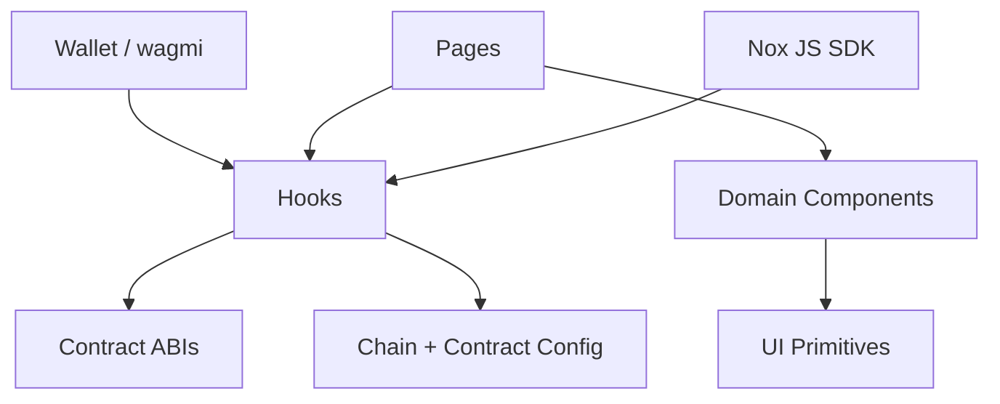
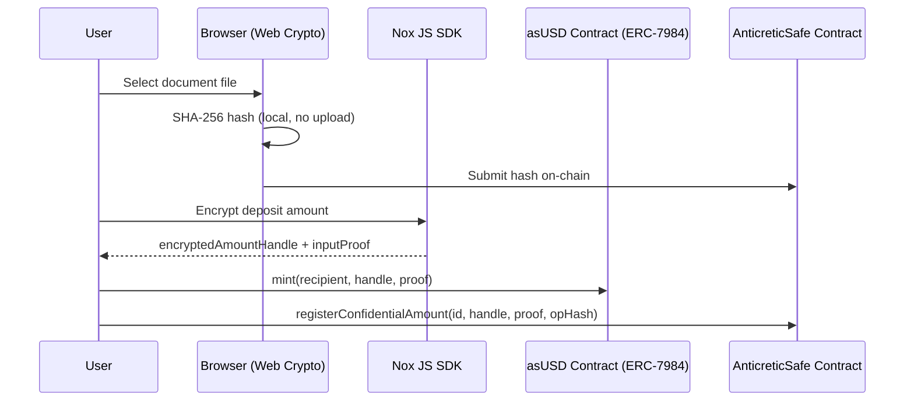

# AnticreticSafe


[](https://vitejs.dev/)
[](https://react.dev/)
[](https://www.typescriptlang.org/)
[](https://tailwindcss.com/)
[](https://sepolia.arbiscan.io)
[](https://sepolia.arbiscan.io/address/0x5e57022c7dfE939456f2aad9B11153d6beAEC06D)


## Table of Contents

- [Overview](#overview)
- [Challenge Context](#challenge-context)
- [Problem and Solution](#problem-and-solution)
- [Deployed Contracts](#deployed-contracts)
- [Architecture](#architecture)
- [Repository Map](#repository-map)
- [10-Step Agreement Workflow](#10-step-agreement-workflow)
- [Role-Based Access](#role-based-access)
- [Web3 and Nox Integration](#web3-and-nox-integration)
- [Gas Strategy](#gas-strategy)
- [Functional Documentation Sources](#functional-documentation-sources)
- [Setup and Scripts](#setup-and-scripts)
- [Evaluation Notes](#evaluation-notes)

---

## Overview

AnticreticSafe digitizes and enforces **anticrético** real estate agreements on-chain. An anticrético is a Latin American lending instrument where an occupant deposits a capital sum with a property owner, lives in the property rent-free, and receives the full capital back at the end of the term.

The front-end (Vite + React + TypeScript) guides both parties through a **10-step dual-role workflow** that records document hashes, approvals, possession events, and financial settlement entirely on Arbitrum Sepolia. The confidential deposit amount is handled via iExec Nox's ERC-7984 Confidential Token so no sensitive financial data appears in plaintext on-chain.

---

## Challenge Context

The project was built for the **iExec Vibe Coding Challenge** using the Nox Confidential Token ecosystem. Challenge requirements, deliverables, and evaluation criteria are documented in [src/documents/Details.md](src/documents/Details.md).

---

## Problem and Solution

Traditional anticrético agreements rely on notaries and paper documents. Disputes arise because:

- There is no verifiable, immutable record of documents (title reports, contracts, registry proofs).
- The deposit amount is stored in cash or informal agreements, creating opacity.
- Possession transfer and capital return have no neutral timestamp.

**AnticreticSafe** solves this by:

- Storing SHA-256 hashes of every legal document on-chain at each step. The hash is computed locally in the browser using the Web Crypto API — the document never leaves the user's machine.
- Using iExec Nox (ERC-7984) to keep the deposit amount confidential while still enforcing its return on-chain.
- Enforcing role-based access so each party only sees and signs what is theirs to sign.
- Providing a live countdown to the capital return date so both parties have a shared source of truth.

Key Nox concepts used:

- Confidential values are represented as `encryptedAmountHandle` + `inputProof` generated by the Nox JS SDK.
- Access control lists authorize which actors can decrypt or reuse handles.
- ERC-7984 Confidential Tokens preserve ERC-20 composability with encrypted balances.

Full Nox protocol reference: [src/documents/NoxDocumentation.md](src/documents/NoxDocumentation.md)

---

## Deployed Contracts

Both contracts are live on **Arbitrum Sepolia** (chain ID `421614`).

### AnticreticSafe — Agreement & Verification Contract

> Manages the full 10-step lifecycle: document hash registration, approvals, possession delivery, money return confirmation, and agreement closure.

| Field | Value |
|---|---|
| **Address** | `0x40e75D0648BCB2F374dF053DeEa8A70e74699545` |
| **Network** | Arbitrum Sepolia |
| **Explorer** | [View on Arbiscan](https://sepolia.arbiscan.io/address/0x40e75D0648BCB2F374dF053DeEa8A70e74699545) |
| **ABI** | [src/abi/anticreticSafeAbi.ts](src/abi/anticreticSafeAbi.ts) |
| **Config** | [src/config/contracts.ts](src/config/contracts.ts) → `ANTICRETIC_SAFE_ADDRESS` |

Key functions called by the UI:

| Function | Called by |
|---|---|
| `agreementCounter()` | Dashboard — counts total agreements |
| `getAgreementCore(id)` | Dashboard — loads parties, status, dates |
| `getAgreementHashes(id)` | Detail view — shows registered document hashes |
| `getAgreementApprovals(id)` | Detail view — tracks who has approved |
| `uploadTitleReport(id, hash)` | Step 1 — Property Owner |
| `approveAgreement(id)` | Step 2 — both parties |
| `uploadAgreementContract(id, hash)` | Step 3 — Property Owner |
| `uploadPublicRegistry(id, hash)` | Step 4 — Property Owner |
| `confirmPossessionDelivery(id, hash)` | Step 6 — Property Owner |
| `confirmPossessionReceived(id)` | Step 6 — Occupant |
| `confirmMoneyReturned(id)` | Step 7 — Occupant |
| `confirmPropertyReturned(id)` | Step 8 — Property Owner |
| `closeAgreement(id, hash)` | Step 9 — Property Owner |

---

### AnticreticSafe USD (asUSD) — ERC-7984 Confidential Token

> Confidential ERC-7984 token used to represent the anticrético deposit amount. Balances are encrypted; only authorized addresses can decrypt them via iExec Nox TEE execution.

| Field | Value |
|---|---|
| **Address** | `0x5e57022c7dfE939456f2aad9B11153d6beAEC06D` |
| **Standard** | ERC-7984 (Confidential Token) |
| **Network** | Arbitrum Sepolia |
| **Explorer** | [View on Arbiscan](https://sepolia.arbiscan.io/address/0x5e57022c7dfE939456f2aad9B11153d6beAEC06D) |
| **ABI** | [src/abi/anticreticSafeUsdAbi.ts](src/abi/anticreticSafeUsdAbi.ts) |
| **Config** | [src/config/contracts.ts](src/config/contracts.ts) → `ANTICRETIC_SAFE_USD_ADDRESS` |

Key functions called by the UI:

| Function | Called by |
|---|---|
| `balanceOf(address)` | Balance panel — shows encrypted balance handle |
| `mint(recipient, handle, proof)` | Step 5 — Property Owner mints asUSD to Occupant |
| `registerConfidentialAmount(id, handle, proof, opHash)` | Step 5 — Occupant registers the confidential amount |

---

## Architecture



Confidential data flow:



---

## Repository Map

| Path | Purpose |
|---|---|
| [src/main.tsx](src/main.tsx) | App entry point |
| [src/App.tsx](src/App.tsx) | Router, wallet context, agreement state |
| [src/pages](src/pages) | Full-page views |
| [src/components](src/components) | Domain + UI components |
| [src/hooks](src/hooks) | All web3 and data logic |
| [src/config](src/config) | Chain, contracts, wagmi config |
| [src/abi](src/abi) | Full contract ABIs (TypeScript) |
| [src/types](src/types) | Shared TypeScript types |
| [src/utils](src/utils) | Format helpers, validation |
| [src/documents](src/documents) | Challenge and Nox reference docs |

---

## 10-Step Agreement Workflow

The `AgreementDetailPage` implements a linear 10-step flow. Both parties progress through it together; each step is gated by the previous one on-chain.

| Step | Name | Actor |
|---|---|---|
| 0 | Agreement Created | Property Owner |
| 1 | Title Report Hash | Property Owner uploads |
| 2 | Both Parties Approve | Both sign on-chain |
| 3 | Signed Contract Hash | Property Owner uploads |
| 4 | Public Registry Proof | Property Owner uploads |
| 5 | Confidential Finance | Owner mints asUSD → Occupant registers |
| 6 | Possession Delivery | Owner delivers → Occupant confirms |
| 7 | Money Return Confirmed | Occupant confirms capital received |
| 8 | Property Returned | Property Owner confirms |
| 9 | Agreement Closed | Property Owner uploads closure proof |

Document hashes at steps 1, 3, 4, 6, 9 are computed locally in the browser (SHA-256 via Web Crypto API) and submitted on-chain. The actual files are never transmitted.

---

## Role-Based Access

The connected wallet is automatically identified as **Property Owner**, **Occupant**, or **Viewer** by comparing the wallet address against `agreement.propertyOwner` and `agreement.occupant`.

- Steps 1, 3, 4, 9: only the **Property Owner** sees the action button; the Occupant sees a waiting message.
- Step 2: both parties sign independently.
- Step 5: Owner executes the mint, Occupant registers the confidential amount.
- Steps 6, 7, 8: role-specific confirmations.

After each confirmed transaction, the hook `useMyAgreements` refetches all on-chain data and the UI auto-advances to the new active step.

---

## Web3 and Nox Integration

### Hooks

| Hook | Purpose |
|---|---|
| [useWallet.ts](src/hooks/useWallet.ts) | Exposes connected address and chain |
| [useConnectedRole.ts](src/hooks/useConnectedRole.ts) | Derives PROPERTY_OWNER / OCCUPANT / VIEWER |
| [useMyAgreements.ts](src/hooks/useMyAgreements.ts) | Reads all on-chain agreements for the wallet |
| [useAgreementWriter.ts](src/hooks/useAgreementWriter.ts) | All write calls to AnticreticSafe |
| [useNoxEncrypt.ts](src/hooks/useNoxEncrypt.ts) | Encrypts amounts via Nox JS SDK |
| [useMintConfidentialAsUSD.ts](src/hooks/useMintConfidentialAsUSD.ts) | Mints asUSD (ERC-7984) |
| [useRegisterConfidentialAmount.ts](src/hooks/useRegisterConfidentialAmount.ts) | Registers confidential amount in the Safe |
| [useConfidentialAsUSDBalance.ts](src/hooks/useConfidentialAsUSDBalance.ts) | Reads encrypted balance handle |

### Web3 UI Panels

Located in [src/components/web3](src/components/web3):

- `WalletConnectButton.tsx` — connect / disconnect with address display
- `NetworkGuard.tsx` — enforces Arbitrum Sepolia
- `MintConfidentialAsUSDPanel.tsx` — Step 5 Owner action
- `RegisterConfidentialAmountPanel.tsx` — Step 5 Occupant action
- `ConfidentialAsUSDBalancePanel.tsx` — reads encrypted balance

---

## Gas Strategy

Arbitrum Sepolia has very low base fees (~0.01–0.05 gwei). To avoid wagmi returning stale gas prices and causing transaction failures, all write hooks compute gas parameters live from the latest block:

```ts
const block = await getBlock(wagmiConfig, { blockTag: 'latest' })
const baseFee = block.baseFeePerGas ?? 100_000_000n
const maxFeePerGas = baseFee * 3n
const maxPriorityFeePerGas = 0n   // tip must be <= baseFee on Arbitrum Sepolia
const gas = BigInt(8_000_000)
```

---

## Functional Documentation Sources

| File | Contents |
|---|---|
| [src/documents/Details.md](src/documents/Details.md) | Challenge requirements and evaluation criteria |
| [src/documents/NoxDocumentation.md](src/documents/NoxDocumentation.md) | Nox protocol, ERC-7984, confidentiality model |

---

## Setup and Scripts

**Requirements:** Node.js 18+

```bash
npm install
npm run dev       # development server
npm run build     # production build
npm run preview   # preview production build
npm run lint      # ESLint check
```

The app connects to Arbitrum Sepolia automatically. Make sure your wallet (MetaMask or compatible) is configured for chain ID `421614`.

RPC: `https://sepolia-rollup.arbitrum.io/rpc`  
Explorer: `https://sepolia.arbiscan.io`

---

## Evaluation Notes

- **Main entry**: [src/main.tsx](src/main.tsx)
- **All on-chain data** is read live from Arbitrum Sepolia — no mocks in the main flow.
- **Contract source files** are referenced in the ABI TypeScript files and the config; Solidity sources may be in a separate `contracts/` folder if present.
- **ABIs**: [src/abi/anticreticSafeAbi.ts](src/abi/anticreticSafeAbi.ts) and [src/abi/anticreticSafeUsdAbi.ts](src/abi/anticreticSafeUsdAbi.ts)
- **Contract config**: [src/config/contracts.ts](src/config/contracts.ts)
- **Chain config**: [src/config/chains.ts](src/config/chains.ts)
- **iExec Tools Feedback**: See [feedback.md](feedback.md) for detailed notes on Nox SDK integration, friction points, and recommendations for the iExec team

