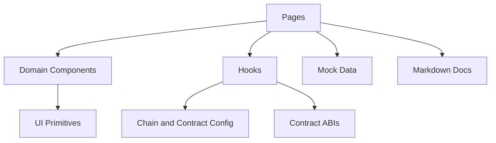
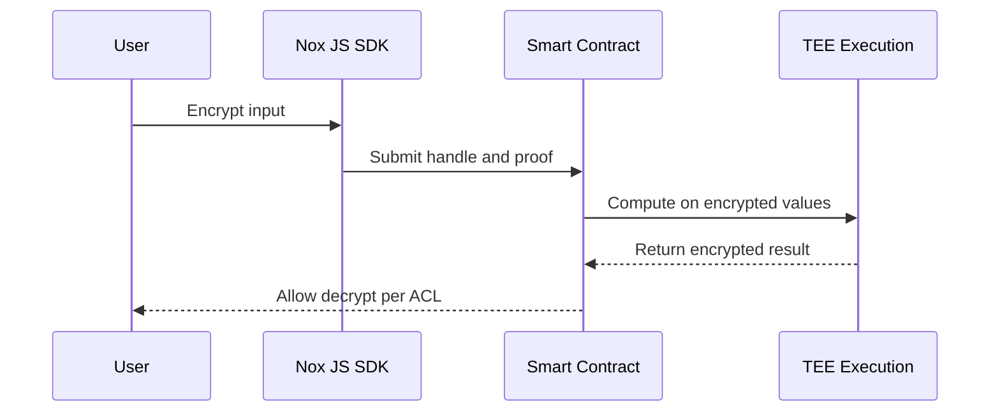

# AnticreticSafe


[](https://vitejs.dev/)
[](https://react.dev/)
[](https://www.typescriptlang.org/)
[](https://tailwindcss.com/)

Front-end for AnticreticSafe. This README is optimized for judges and automated evaluation agents. It prioritizes clarity, verifiable references to real files, and a structured overview of the system.

## Table of Contents

- [Overview](#overview)
- [Challenge Context](#challenge-context)
- [Problem and Solution](#problem-and-solution)
- [Architecture](#architecture)
- [Repository Map](#repository-map)
- [User Flows](#user-flows)
- [Web3 and Nox Integration](#web3-and-nox-integration)
- [Contracts and ABIs](#contracts-and-abis)
- [Functional Documentation Sources](#functional-documentation-sources)
- [Setup and Scripts](#setup-and-scripts)
- [Evaluation Notes](#evaluation-notes)

## Overview

AnticreticSafe is a Vite + React + TypeScript front-end for an anticretic agreement workflow. The UI is organized by pages, domain components, and hooks that encapsulate web3 logic. Styling uses Tailwind CSS with reusable primitives.

## Challenge Context

The project aligns with the iExec Vibe Coding Challenge and the Nox Confidential Token ecosystem. The official challenge context, deliverables, and evaluation criteria are summarized in [src/documents/Details.md](src/documents/Details.md).

## Problem and Solution

Nox provides confidential computation for DeFi and RWA use cases while remaining composable with existing protocols. Confidentiality applies to balances and amounts, not addresses. The core concepts that inform this front-end are described in [src/documents/NoxDocumentation.md](src/documents/NoxDocumentation.md).

Key concepts used as product assumptions:

- Confidential values are represented as handles and processed off-chain in TEEs.
- Access control lists authorize which actors can decrypt or reuse handles.
- Confidential Tokens (ERC-7984) preserve ERC-20 composability with encrypted balances.

## Architecture



Confidential data flow conceptual model (from Nox docs):



## Repository Map

- Entry points: [src/main.tsx](src/main.tsx), [src/App.tsx](src/App.tsx)
- Pages: [src/pages](src/pages)
- Domain components: [src/components](src/components)
- Hooks: [src/hooks](src/hooks)
- Web3 config: [src/config](src/config)
- ABIs: [src/abi](src/abi)
- Mock data: [src/data](src/data)
- Functional docs: [src/documents](src/documents)

## User Flows

1. Landing with product framing and value proposition.
2. Dashboard with role-aware agreement summaries.
3. Create agreement and register confidential amounts.
4. Agreement detail view with timeline, documents, and next actions.

Primary page implementations:

- Landing: [src/pages/LandingPage.tsx](src/pages/LandingPage.tsx)
- Dashboard: [src/pages/DashboardPage.tsx](src/pages/DashboardPage.tsx)
- Create agreement: [src/pages/CreateAgreementPage.tsx](src/pages/CreateAgreementPage.tsx)
- Agreement detail: [src/pages/AgreementDetailPage.tsx](src/pages/AgreementDetailPage.tsx)

## Web3 and Nox Integration

The web3 flow is encapsulated in hooks and panel components.

Hooks:

- Wallet and role: [src/hooks/useWallet.ts](src/hooks/useWallet.ts), [src/hooks/useConnectedRole.ts](src/hooks/useConnectedRole.ts)
- Agreement actions: [src/hooks/useAgreementWriter.ts](src/hooks/useAgreementWriter.ts)
- Confidential amount registration: [src/hooks/useRegisterConfidentialAmount.ts](src/hooks/useRegisterConfidentialAmount.ts)
- Confidential token minting: [src/hooks/useMintConfidentialAsUSD.ts](src/hooks/useMintConfidentialAsUSD.ts)
- Confidential balance: [src/hooks/useConfidentialAsUSDBalance.ts](src/hooks/useConfidentialAsUSDBalance.ts)

Web3 panels:

- [src/components/web3](src/components/web3)

## Contracts and ABIs

Solidity contracts:

- [contracts/AnticreticSafe.sol](contracts/AnticreticSafe.sol)
- [contracts/AnticreticSafeUSD.sol](contracts/AnticreticSafeUSD.sol)

ABIs consumed by the UI:

- [src/abi/anticreticSafeAbi.ts](src/abi/anticreticSafeAbi.ts)
- [src/abi/anticreticSafeUsdAbi.ts](src/abi/anticreticSafeUsdAbi.ts)

Network and contract config:

- [src/config/chains.ts](src/config/chains.ts)
- [src/config/contracts.ts](src/config/contracts.ts)
- [src/config/wagmi.ts](src/config/wagmi.ts)

## Functional Documentation Sources

This README is informed by the following internal sources:

- [src/documents/Details.md](src/documents/Details.md) for challenge requirements, deliverables, and evaluation criteria.
- [src/documents/NoxDocumentation.md](src/documents/NoxDocumentation.md) for Nox protocol concepts, confidentiality model, and ERC-7984 behavior.

## Setup and Scripts

Requirements:

- Node.js 18+ recommended

Install and run:

```bash
npm install
npm run dev
```

Common scripts:

```bash
npm run build
npm run preview
npm run lint
```

## Evaluation Notes

Based on the challenge requirements documented in [src/documents/Details.md](src/documents/Details.md), reviewers typically check:

- End-to-end functionality without relying on mocked data for core flows.
- Deployment on Sepolia Arbitrum or Arbitrum, if applicable.
- Presence of a feedback document (feedback.md) if required by the challenge.
- A short demo video showcasing the application.

This repository includes mock data for UI development in [src/data/mockAgreements.ts](src/data/mockAgreements.ts). Confirm live data and contract-backed flows when evaluating for production or challenge compliance.

---

If you want an additional section for test plans, UX decisions, or deployment instructions, I can extend this README.